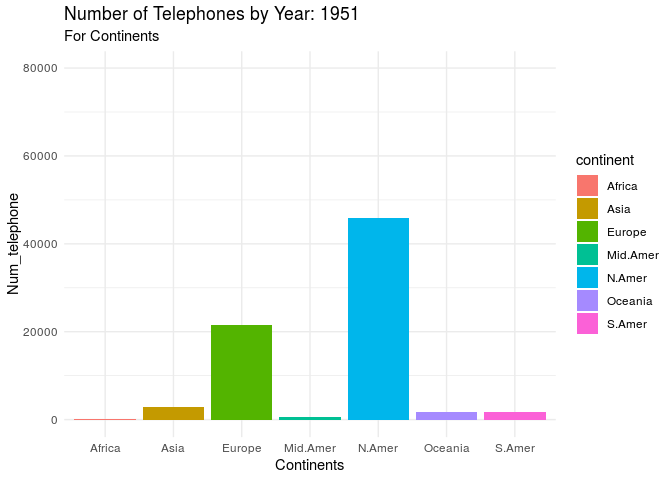
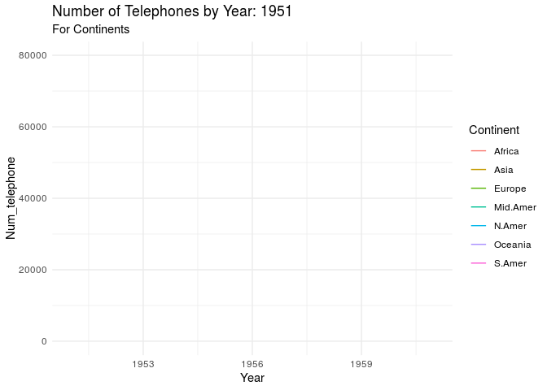
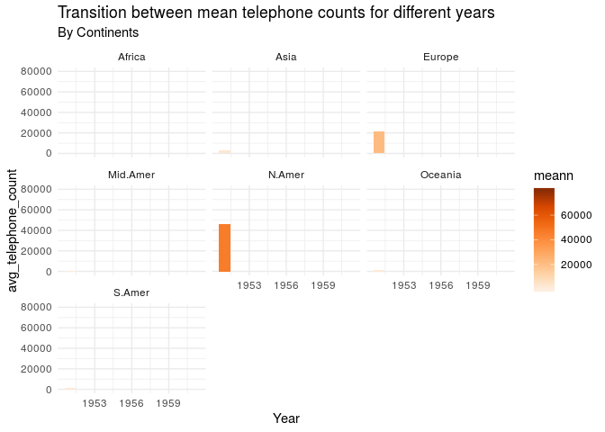

### Load packages

**From the list of the packages, I am using gganimate package. This package extends the grammar of graphics as implemented by ggplot2 to include the description of animation. This package is available on CRAN and it was installed and loaded as follows:**

```r
#install.packages('gganimate')
library(ggplot2)
library(gganimate)
library(MASS)
library(dplyr)
library(tidyverse)
library(gifski)
library(png)
library(lubridate)
```


**Inorder to implement this package, I have used inbuilt R dataset called WorldPhones which consist of number of telephones in different continent. The data is loaded and summarized as follows:**

```r
world <- as.data.frame(WorldPhones)
summary(world)
```

```
##      N.Amer          Europe           Asia          S.Amer    
##  Min.   :45939   Min.   :21574   Min.   :2876   Min.   :1815  
##  1st Qu.:62572   1st Qu.:31250   1st Qu.:4969   1st Qu.:2632  
##  Median :68484   Median :35218   Median :6662   Median :2845  
##  Mean   :66748   Mean   :34343   Mean   :6229   Mean   :2772  
##  3rd Qu.:73918   3rd Qu.:38970   3rd Qu.:7538   3rd Qu.:3072  
##  Max.   :79831   Max.   :43173   Max.   :9053   Max.   :3338  
##     Oceania         Africa        Mid.Amer     
##  Min.   :1646   Min.   :  89   Min.   : 555.0  
##  1st Qu.:2446   1st Qu.:1478   1st Qu.: 753.0  
##  Median :2691   Median :1663   Median : 836.0  
##  Mean   :2625   Mean   :1484   Mean   : 841.7  
##  3rd Qu.:2961   3rd Qu.:1837   3rd Qu.: 959.5  
##  Max.   :3224   Max.   :2005   Max.   :1076.0
```

**This data is in untidy format so I have made some gathered the data according to year, telephone_count and continent. Since the year was character format I have changed it into date format.**

```r
world$year <- rownames(world)

world_data <- world %>%
  gather(continent, tele_count, N.Amer:Mid.Amer)%>%
  mutate(year = as.Date(year, format = "%Y")) %>%
  mutate(year = year(year))

str(world_data$year)
```

```
##  num [1:49] 1951 1956 1957 1958 1959 ...
```

**Here, the number of telephone in various continent is annimated for years from 1951 to 1961. We can see that for all the continents the number of telephone gradually increases after each year. There is noticable change in North America, Europe and Asia compared to others.
Here the ,function of transition time is to change through distinct states in time.**

```r
 ggplot(world_data,aes(x=continent, y=tele_count, fill=continent)) +
   geom_bar(stat = "identity") +
 transition_time(year) +
   theme_minimal() +
   labs(title= "Number of Telephones by Year: {as.integer(frame_time)}", subtitle ="For Continents", x="Continents", y="Num_telephone")
```

<!-- -->

**Here, the number of telephone in various continent is annimated for years from 1951 to 1961 using the line plot. This transition reveal allows you to let data gradually appear, based on a given time dimension.**

```r
 ggplot(world_data, aes(year, tele_count, group = continent, color = factor(continent))) +
  geom_line() +
   transition_reveal(year)   +
  theme_minimal() +
   labs(title= "Number of Telephones by Year: {as.integer(frame_along)}", subtitle="For Continents", x="Year", y="Num_telephone",color="Continent")
```

<!-- -->

**The following annimation shows transition of average telephone counts for different years for various Continents. First, the average count of telephones in different year by continent is calculated. The highest number of count is indicated by darker color. We can see that highest telephone count is in North America in the year 1961. **

*This transition splits the data into multiple states based on the levels in a given column. It then tweens between the defined states and pauses at each state. Here, the relative length of the pause at the each year is given as 1.*


```r
summary_mean <- world_data %>%
  group_by(continent,year) %>%
  summarize(meann = mean(tele_count))

ggplot(summary_mean, aes(year, meann, fill = meann)) +
  geom_col() +
  facet_wrap(~continent) +
  scale_fill_distiller(palette = "Oranges", direction = 1) +
  theme_minimal() +
  transition_states(year, wrap = FALSE,state_length = 1) +
  shadow_mark() +
   labs(title= "Transition between mean telephone counts for different years", subtitle="By Continents", x="Year", y="avg_telephone_count",color="Avg_telephone_count")
```

<!-- -->

